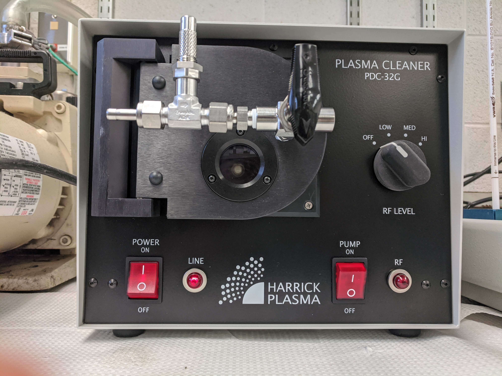
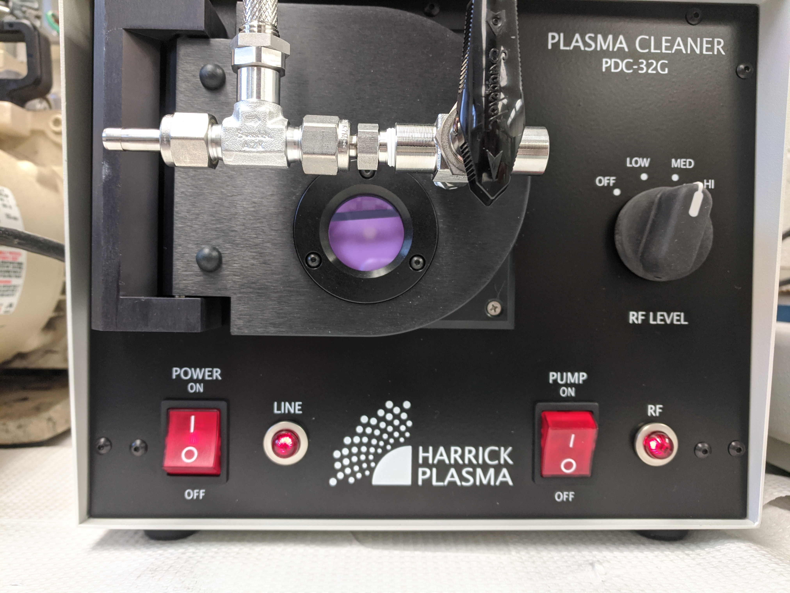
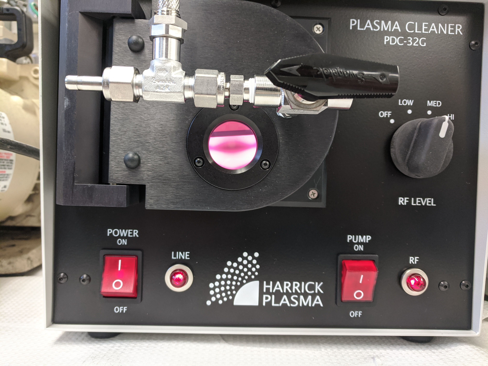

# Plasma Bonding

Microwell chambers made from PDMS are hydrophobic and need to be treated with a plasma cleaner to allow the wells to be initially filled. This process introduces hydroxyl groups onto the PDMS surface, making it more hydrophillic and also allowing bonding between treated glass surfaces.

</IMG>

### Sample cleaning

1. Clean the surface of all glass slides and coverslips to be used with ethanol or isopropanol and kimwipes to remove any dust or debris.
2. Use Scotch tape to remove any dust from the PDMS prior to treatment. Alternatively, PDMS can be cleaned with ethanol or isopropanol and cotton swabs, followed by washing with DI water.

### Bonding

1. Load samples. The surfaces to be treated should be facing up.
2. Close the sample door.
3. Ensure that the valve is closed, with the handle pointing downward, as pictured above.
4. Turn on the main power to the plasma cleaner.
5. Turn on the vacuum pump.
6. Wait ~30s for the chamber to pump down to vacuum pressure.
7. Turn on the RF to low power. There should be a purple glow coming from the chamber.

</IMG>

8. Turn the valve to the left to allow air to flow through the metering valve to create the plasma. The glow should turn magenta.

</IMG>

9. Treat the samples for 1-5 mins.
10. Turn off the RF power.
11. Turn off the vacuum pump.
12. Vent the chamber by slowly turning the valve counter-clockwise.
13. Remove samples from chamber.
14. Add liquid to microwells and ensure even distribution.
15. Bond the PDMS to the coverslip, removing any excess liquid with a kimwipe or pipette.

### References
https://ocw.mit.edu/courses/health-sciences-and-technology/hst-410j-projects-in-microscale-engineering-for-the-life-sciences-spring-2007/labs/plasma_bonding.pdf
