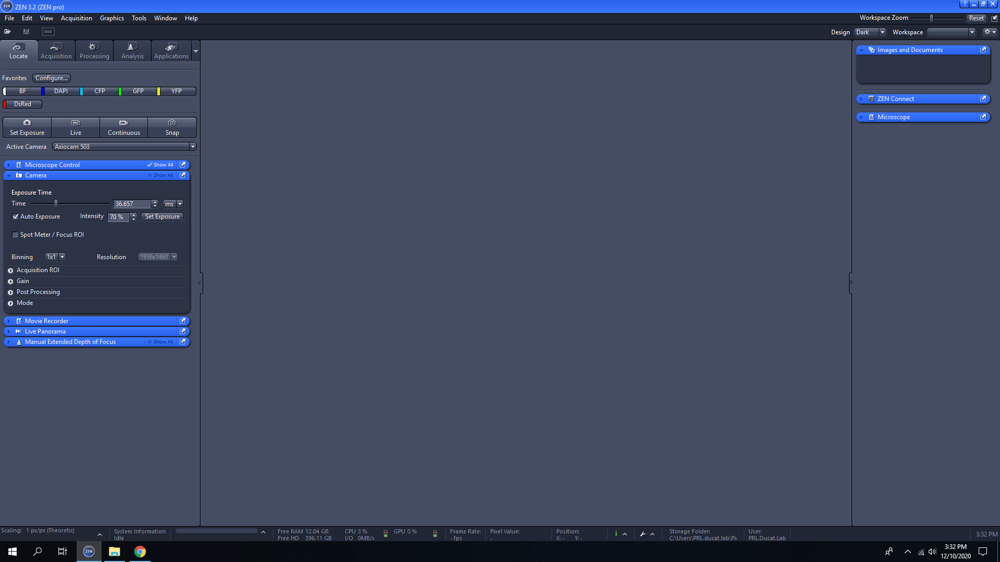
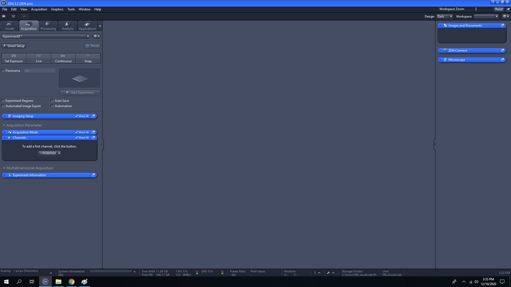
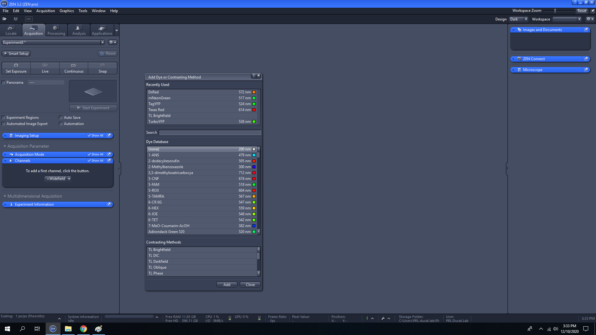
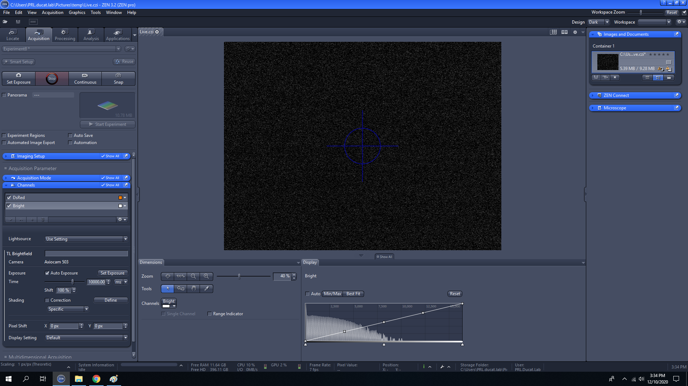

# Quickstart guide for Zeiss Axio Observer Microscope

</IMG>
1. Turn on PC and login to Windows using the Ducatlab account.

## Microscope Operation

2. Turn on reflected light (RL) illumination source. Allow up to 30 mins for the lamp to warm up prior to imaging.

</IMG>

3. Turn on the microscope.

</IMG>

4. Place sample onto sample holding tray.
5. Select the appropriate imaging objective by rotating the turret. The objective details (e.g., magnification and numerical aperture (NA)) will be displayed on the microscope stand screen.

</IMG>

## Image Capture

6. Start the Zen image capture software. Ensure that the software recognizes the camera (could take up to a minute to load).

</IMG>

7. Select the Acquisition tab. Either select the desired experiment from the drop-down menu or select the gear on the top right of the panel to create a new experiment setup.

</IMG>

8. Add imaging channels by selecting the "Channels" tab under "Acquisition Parameter" and clicking the "+Widefield" button.

</IMG>

9. Keep in mind that the options displayed do not necessarily correspond with the specific capabilities of the Observer D1. It is advisable to double-check that the correct filter cube is mapped to the desired channels (Imaging Setup > Advanced). The microscope typically has filter cubes installed for DAPI/CFP/GFP/YFP/DsRed.
10. Click the "Live"  button to see a live image of your sample. When you are satisfied with the field of view, click "Snap" to capture the image.

</IMG>

11. To incorporate naming schemes into your image files, check the "Auto Save box".

## Troubleshooting

### Transmitted light channel is dark
- Ensure that live view is on
- Try increasing the intensity of the TL source by turning the TL knob on the front of the microscope stand.

</IMG>

-
